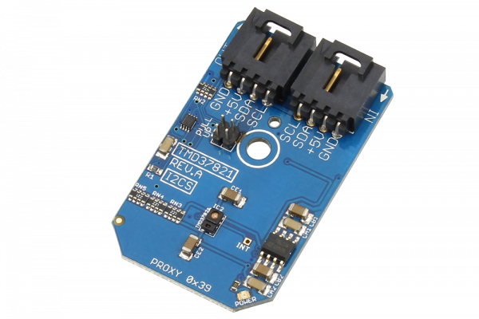

[](https://store.ncd.io/product/tmd37821-color-light-to-digital-converter-with-proximity-sensing-i2c-mini-module/).

#  TMD37821

The TMD37821is a color light-to-digital converter that performs color temperature measurement, ambient light sensing (ALS) and proximity detection with background light rejection.This device is able to detect light through dark glass along with other objects that have a gradual loss in light intensity.The TMD37821 includes an internal state machine that gives the ability to put the device into a low power state between proximity and RGBC (Red, Green, Blue, Clear) measurements.
This Device is available from www.ncd.io 

[SKU: TMD37821]

(https://store.ncd.io/product/tmd37821-color-light-to-digital-converter-with-proximity-sensing-i2c-mini-module/)
This Sample code can be used with Raspberry Pi.

Hardware needed to interface TMD37821 color light to digital converter sensor With Raspberry Pi :
1. <a href="https://store.ncd.io/product/tmd37821-color-light-to-digital-converter-with-proximity-sensing-i2c-mini-module/">TMD37821 color light to digital converter sensor</a>
2.  <a href="https://store.ncd.io/product/i2c-shield-for-raspberry-pi-3-pi2-with-outward-facing-i2c-port-terminates-over-hdmi-port/">Raspberry Pi I2C Shield</a>
3. <a href="https://store.ncd.io/product/i%C2%B2c-cable/">I2C Cable</a>

## Python
Download and install smbus library on Raspberry pi. Steps to install smbus are provided at:

https://pypi.python.org/pypi/smbus-cffi/0.5.1

Download (or git pull) the code in pi. Run the program.

```cpp
$> python TMD37821.py
```
The lib is a sample library, you will need to calibrate the sensor according to your application requirement.
